# Problem set answers for MITs 8.033 using real valued quaternions

1. [Problem set 1](problem_set_1.md)
1. [Problem set 2](problem_set_2.md)
1. [Problem set 3](problem_set_3.md)
1. [Problem set 4](problem_set_4.md)
1. [Problem set 5](problem_set_5.md)
1. [Problem set 6](problem_set_6.md)

# 8.033 Problem Set 1, Kinematic Effects of Relativity

##  Preamble: Initiation functions

There are a few tools required to solve problems in special relativity using
quaternions to characterize events in spacetime. The most basic are gamma and
a round value for c.

Define a function for quaternions using its matrix representation.

A quaternion L that perform a transform on a quaternion -  
L q[**x**] = q[**x'**] - identical to how the Lorentz transformation acts on
4-vectors - Lambda **x** = **x'** \- should exist. These are described in
detail in the notebook "A different algebra for boosts." For boosts along the
x axis with y = z = 0, the general function for L is

Most of the problems here involve much simpler cases for L, where t or x is
zero, or t is equal to x.

If t = 0, then

If x = 0, then

If t = x, then

    
    

Note: this is for blueshifts. Redshifts have a plus instead of the minus.

The problems are from "Basic Concepts in Relativity" by Resnick and Halliday,
1992 by Macmillian Publishing, "Special Relativity" by A. P. French, 1966,
1968 by MIT, and Prof. M. Baranger of MIT.

##  R&amp;H 2-9: A moving clock

Q: A clock moves along the x axis at a speed of 0.6c and reads zero as it
passes the origin. What time does it read as it passes the 180 m mark on the x
axis?

A: A clock measures an interval between two events. The first event occurs at
the origin. The second event happens at 180 m in a time of 180 m/v. Calculate
the interval by squaring the difference quaternion and then taking the square
root of the first term.

    

The moving clock reads 8 x 10^-7^ seconds.

##  R&amp;H 2-10: A moving rocket

Q: A rod lies parallel to the x axis of reference frame S, moving along this
axis at a speed of 0.6c. Its rest length is 1.0 m. What will be its measured
length in frame S?

A: Consider the meter stick at rest in a frame S', one end at the origin, the
other at q[0, 1 m, 0, 0]. We want to boost the stick end quaternion to frame
S. The boost quaternion when t=y=z=0 is
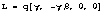. In frame S',frame S is moving at -0.6c.

The start of the stick will move for a time equal to the first term of the
boosted quaternion, and moved by a distance x = vt/c.

The meter stick's length in frame S will be the difference at the same instant
in this frame between the boosted stick end and translocated stick start.

    
    

The meter stick is length contracted to 0.8 meters in frame S.

##  R&amp;H 2-13: A fast spaceship

Q: The length of a spaceship is measured to be exactly half its rest length.
(a) What is the speed of the spaceship relative to the observer's frame? (b)
By what factor does the spaceship's clocks run slow, compared to clocks in the
observer's frame?

A: (a) Consider the spaceship at rest, one end at the origin, the other at
q[0, d, 0, 0]. We want to boost the ship end quaternion to the observer's
frame. The boost quaternion when t=y=z=0 is
. In the ship'sframe, the observer is moving at -v/c.

The start of the ship will move for a time equal to the first term of the
boosted quaternion, and moved by a distance x = vt/c.

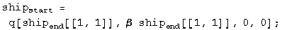

The ship's length in the observer's frame will be the difference at the same
instant in this frame between the boosted ship end and translocated ship
start.

    
    

Solve for beta setting this distance to d/2.

    
    

Beta is ![\[Graphics:ps1gr27.gif\]](images/SR/problem_set_1/ps1gr27.gif)/2 =
0.866.  
  
(b) The factor that the clocks appear to run at different rates is gamma.

    
    

# 8.033 Problem Set 2, More Kinematic Effects of Relativity

##  French: 4-5

Q: A rocketship of proper length d travels at constant velocity v relative to
a frame S. The nose of the ship (A') passes the point A in S at t = t' = 0,
and at this instant a light signal is sent out from A' to B' (the end of the
ship). (a) When, b y rocketship time (t'), does the signal reach the tail (B')
of the ship? (b) At what time t1, as measured in S, does the signal reach the
tail (B') of the ship?  
(c) At what time t2, as measured in S, does the tail of the ship (B') pass the
point A?

A: (a) In the rocket's frame, the light is emitted a proper length d from the
origin traveling at c, so t' = d/c.

(b) In the rocket's frame, the event of the signal reaching the tail is
represented by the quaternion
. In frame S, thelight is blueshifted because the rocket is approaching at a speed of -beta.

    
    

The time the signal arrives in frame S is
.
(c) The length of the ship in frame S must be calculated first. Boost the
ship's end at q[0, d, 0, 0] to frame S. The boost quaternion is
.

The start of the ship will move for a time equal to the first term of the
boosted quaternion, and moved by a distance x = vt/c.

The ship's length in frame S will be the difference at the same instant in
this frame between the boosted ship end and translocated ship start.

    
    

    
    

The time the rocketship's tail arrives is
 in frame S.
##  French: 4-9

Q: Two spaceships, each measuring 100 m in its own rest frame, pass by each
other traveling in opposite directions. The instruments on spaceship A
determine that the front end of spaceship B requires 5 microseconds to
traverse the full length of A. ( a) What is the relative velocity of the 2
spaceships? (b) A clock in the front end of B reads exactly one o'clock as it
passes by the front end of A. What will the clock read as it passes by the
rear end of A?

A: (a) Given a length and a time, divide one by the other to get the relative
velocity.

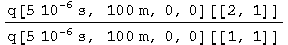

    
    

The relative velocity is 2 x 10^7 m/s.

(b) The proper time of the clock in rocketship B is the interval, which when
using quaternions is the square root of the first term of the quaternion
squared.

    
    

The clock in rocket B reads one o'clock plus 4.99 microseconds.

##  French: 4-12

Q: At noon a rocketship passes the Earth with a velocity 0.8c. Observers on
the ship and on the Earth agree that it is noon.  
(a) At 12:30 P.M. as read by a rocketship clock, the ship passes an
interplanetary navigational station that is fixed rel ative to the Earth and
whose clocks read Earth time. What time is it at the station? (b) How far from
the Earth (in Earth coordinates) is the station?  
(c) At 12:30 P.M. rocketship time the ship reports by radio back to Earth.
When (by Earth time) does the Earth receive the signal?  
(d) The station on Earth replies immediately When (by rocket time) is the
reply received?  
Solve this problem TWICE, once using the Earth as a reference frame and then
using the rocket at the reference frame.

A: (a) From the Earth frame, we are given the proper time on the rocket clock
as 30'. This interval is equal to the one seen by the Earth, which is
calculated by squaring the quaternion and solving for t.

    
    

The time on the Earth clock is 50 min.

(b) Multiply the time by the speed and get the units right.

    
    
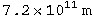
The distance is 7.2 x
 meters.
(c) The time of the rocket emitting the signal, 50', plus its travel time from
that location, 50' v/c = 40, is 90', or 1:30.

    
    

(d) Find the intersection of the world line of the rocket, x/c = v t/c, and
the world line of the light emitted from the Earth at 90 min,  
x/c = t - 90'.

    
    

The position of the event is 450' v/c = 360'. We need the proper time of this
interval, which will be the time on the rocket clock.

    
    
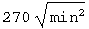
At 4:30 rocket time, the light from the Earth will be received at the rocket.

A': Now from the rocket frame...  
(a') From the rocket frame, we are given t=30', x = 0. We need to boost this
proper time interval to the Earth's frame.

    
    

The time in the Earth frame is 50 min.

(b') The distance from the Earth in the Earth's frame is the second term of
the above quaternion. Convert 40 min to meters.

    
    

The distance is 7.2 x
 meters.
(c') Find the intersection of the world line of the Earth, x/c = -v t/c, and
the light emitted at 30', x/c = -t + 30.

    
    

The position of this event is 150' v/c = 120'. We need the proper time of this
interval, which will be the time on the Earth clock.

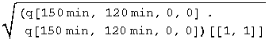

    
    

At 1:30 Earth time, the light will be received from the rocket.

(d') It is 150' in the rocket frame when the Earth emits the signal. It will
take 120' for the signal to arrive. 150' + 120' = 270' or 4:30.

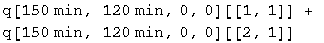

    
    

The same answer again!

##  R &amp; H: 2-14 A slow airplane

Q: An airplane whose rest length is 40.0 m is moving at a uniform velocity
with respect to the Earth at a speed of 630 m/s. (a) By what fraction of its
rest length will it appear to be shortened to an observer on Earth? (b) How
long would it take by Earth clocks for the airplane's clock to fall behind by
1 microsecond, assuming that only special relativity applies?

A: (a) Boost the plane's tail in the plane's frame to the Earth's frame by a
speed of -630 m/s.

    
    
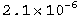

Calculate the distance traveled by the nose in this amount of time.

Subtract the distance traveled by the nose from the tail. Take the ratio of
this difference with the rest length.

    
    

The ratio of lengths as seen on the Earth is 1 minus this small number.

(b) We want to know the differential time between a boosted clock and one at
rest. This is the first term of the difference between a boosted and unboosted
clock.

    
    

Set this equal to 1 microsecond and solve for t.

    
    
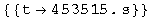
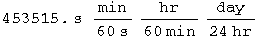

    
    

The plane must travel for 4.53x10^5 s to get out of sync by a microsecond with
the Earth, or 5.25 days.

##  R &amp; H: 2-21 Travel to the galactic center!

Q: (a) Can a person, in principle, travel from Earth to the galactic center
(which is about 28,000 lyr distant) in a normal lifetime? (b) What constant
velocity would be needed to make the trip in 30 years (proper time)?

A: (b) Boost the rocketeer up to the BIG speed B=1-e, set the distance to the
destination d, and solve for e.

    
    

Plug in numbers.

    
    

The constant speed required to make the trip in 30 years is 1 - 5.7 x 10^-7
less than c. The answer to (a) is that as a purely mathematical exercise, one
could say yes. However, this does not account for the energy required to reach
such a speed. An analysis which investigated the energy requirements would
probably conclude that it cannot be done.

##  R &amp; H: 2-24 Decay in flight (II)

Q: The mean lifetime of muons stopped in a lead block in the laboratory is
measured to be 2.2 microseconds. The mean lifetime of high-speed muons in a
burst of cosmic rays observed from the Earth is measured to be 16
microseconds. Find the speed of these cosmic ray muons.

A: Boost the muon from its rest frame to the lab.

Set the time component of the quaternion equal to 16 microseconds.

    
    
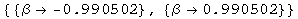
The muon is travelling 0.9905 c.

##  R &amp; H: 2-25 Decay in flight (III)

Q: An unstable high-energy particle enters a detector and leaves a track 1.05
mm long before it decays. Its speed relative to the detector was 0.992c. What
is its proper lifetime?

A: Boost the proper path of unknown length L by v/c = 0.992, solve for L given
the lab length L'.

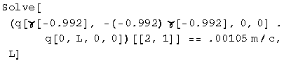

    
    

The average lifetime is 4.4 x
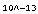 s.
##  R &amp; H: 2-26 Decay in flight (IV)

Q: In the target area of an accelerator laboratory there is a straight
evacuated tube 300 m long. A momentary burst of 1 million radioactive
particles enters at one end of the tube, moving at a speed of 0.80c. Half of
them arrive at the other end wi thout having decayed. (a) How long is the tube
as measured by an observer moving with the particles? (b) What is the half-
life of the particles in this same reference frame? (c) With what speed is the
tube measured to move in this frame?

A: (a) Same as above.

    
    

The tube looks 180 m long to the moving particles.

(b) The length of the target is equal to one half life, t = L/v.

    
    

The half life is 750 nanoseconds.

(c) By symmetry, v = 0.8c. By calculation.

    
    
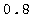
The tube looks like it is moving 0.8c in the rest frame of the particles.

##  R &amp; H: 2-28 Simultaneous - but to whom?

Q: An experimenter arranges to trigger two flashbulbs simultaneously, a blue
flash located at the origin of his reference frame and a red flash at x = 30
km. A second observer is moving at a speed of 0.25c in the direction of
increasing x, and also v iews these flashes. (a) What time interval between
them does he find?  
(b) Which flash does he say occurs first?

A: (a) For the first observer, the blue flash stays at the origin. The red
flash is boosted to a new location in spacetime.

    
    

There will be 26 microseconds between the flashes.

(b) The origin won't change under the boost. From part (a) the flash of red
light event will be changed to -26 microseconds. Therefore the red light
appears first to the rocketeer.

##  R &amp; H: 2-36 What time is it anyway?

Q: Observers S and S' stand at the origins of their respective frames, which
are moving relative to each other with a speed of 0.6c. Each has a standard
clock, which, as usual, they set to zero when the two origins coincide.
Observer S keeps the S' clock visually in sight. (a) What time will the S'
clock record when the S clock records 5 microseconds? (b) What time will
observer S actually read on the S' clock when his own clock reads 5
microseconds?

A: (a) We must determine the proper time for a clock with t = 5 microseconds,
and x = v t, by taking the square root of the first term of the event
quaternion squared.

    
    

The S' clock will record 4 microseconds when the clock in S reaches 5
microseconds.

(b) The intersection of the worldline of the rocket, x/c = 0.6 t and a
lightcone passing through t = 5 microseconds, x = 0 can be solved for t.

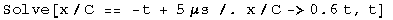

    
    

The S' clock will read the interval of the quaternion at this intersection.
Calculate the interval as in part (a).

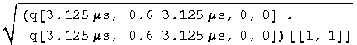

    
    

At 5 microseconds, the observer in frame S will actually see 2.5 microseconds
on the S' clock.

##  Baranger: The cat's life

Q: A newborn cat is put aboard a ship leaving Earth for Andromeda at speed v =
0.6c. The cat dies on the ship at age 7 years. (a) How far from the Earth in
the Earth's frame is the ship when the cat dies? (b) A radio signal is sent
from the ship wh en the cat dies. When does this signal get to the Earth by
Earth time?  
(c) Bonus: What is the probability amplitude that Schr&ouml;dinger killed the cat?

A: (a) The proper time of the cat's life is 7 years. Boost it to the Earth's
frame.

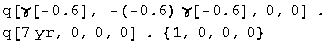

    
    

In the Earth's frame, the cat died after traveling a distance equal to 5.25
years.

(b) It will take 5.25 years for the light to get back from the time when the
cat died (8.75 years), so the signal reaches Earth in  
5.25 + 8.75 = 14 years.

(c) Schr&ouml;dinger posed the question as a joke. He is _definitely_ still
laughing.

##  Baranger: A particle's life

Q: A particle moving with speed v = 0.99c goes on the average a distance 12.5
m before decaying. What is its proper lifetime?

A: Take the lifetime of the particle in its own frame, boost it to the lab's
frame.

In the lab, x = 12 m. Set them equal, solve for the lifetime.

    
    

The lifetime is 5.7 ns.

##  Baranger: Trains &amp; clocks

Q: The train is moving with a velocity v. At the head of the train, the
engineer compares her clock C'1 with a stationary clock C1 outside as she
passes it, and finds that both clocks read time zero. At the same moment (for
the train frame) the cond uctor in the caboose compares his clock C'2 (which
therefore also reads zero) with a stationary clock C2 he happens to be
passing. What does C2 read? The distance between the clocks C'1 and C'2
measured by people on the train is L.

A: The interval for both sets of clocks is L/C. For the observer on the
ground, set the time to t, the distance to vt/c. Square this quaternion, set
the first term equal to the square of the interval, and solve for t.

    
    

The clock will read
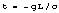. Note that_Mathematica_ has erroneously injected a factor of I into the "solution".

##  Baranger: Blow up the Earth

Q: Some inhabitants of the Andromeda nebula are traveling through the Milky
Way in a flying saucer whose constant velocity equals 0.8c. Going by the
Earth, they find out that it is A. D. 1996 here and they synchronize their
clocks with ours. In A. D . 2005, mankind blows up the Earth. At what time, on
their clock, do the travellers in the flying saucer learn of this event,
assuming that they have been watching us all along through a telescope. Try a
few ways of doing this problem.

A: From the frame of the Earth, find the intersection of the world line of the
saucer, x/c = 0.8 t, and the light cone from the explosion of the Earth, x/c =
t + 9 yr.

    
    

The saucer has travelled a distance d = v t. Calculate the interval which will
give the saucer's proper time.

    
    

In 27 years time, or 2023, the saucer will note the demise of Earth.

A': Repeat the calculation from the saucer frame. We know the interval is 9
years.

    
    

The position will be x = v t = 12 years, which will take another twelve years
to return, for a total of 27 years.

##  Initialization functions

There are a few tools required to solve problems in special relativity using
quaternions to characterize events in spacetime. The most basic are a round
value for c and gamma.

Define a function for quaternions using its matrix representation.

A quaternion L that transforms a quaternion (L q[**x**] = q[**x'**]) identical
to how the Lorentz transformation acts on 4-vectors  
(Lambda **x** = **x'**) should exist. These are described in detail in the
notebook "A different al gebra for boosts." For boosts along the x axis with y
= z = 0, the general function for L is

Most of the problems here involve much simpler cases for L, where t or x is
zero, or t is equal to x.

If t = 0, then

    
    

If x = 0, then

    
    

If t = x, then

    
    

Note: this is for blueshifts. Redshifts have a plus instead of the minus.

The problems are from "Basic Concepts in Relativity" by Resnick and Halliday,
1992 by Macmillian Publishing, "Special Relativity" by A. P. French, 1966,
1968 by MIT, and Prof. M. Baranger of MIT.

# 8.033 Problem Set 3: The Lorentz transformation and addition of velocities

##  Lorentz transformations

##  Baranger: Inverse of a boost

Q: Start from the 4 Lorentz equations giving the variables T, X, Y, and Z in
terms of t, x, y and z, and solve these equations for t, x, y and z in terms
of T, X, Y, and Z. Make sure the result is what you expected.

A: The problem will be solved for a boost transformation without any angular
momentum (the case for y and z not equal to zero just gets messier, not
deeper).

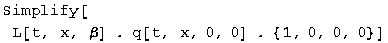

    
    

L q = q', so q = L^-1 q'. L's inverse always exists and is straight forward to
calculate: the inverse is the transpose divided by the square of the norm.

    
    

(The inverse was big and ugly, that's why it was hidden from view, but it does
work! The things that change are the sign of the second component and the
normalization factor which is quite bulky).

##  Baranger: Boosting photons

Q: In frame S, a flash of light is emitted at the origin and is absorbed on
the x axis at x = d. Answer the following questions from the point of view of
frame S', moving in the standard way: (a) What is the spatial separation d'
between the point of emission and the point of absorption of the light? (b)
How much time elapses between the emission and the absorption?

A: (a) In frame S, the point of absorption is q[d, d, 0, 0]. Boost this to
frame S', and look at the x component.

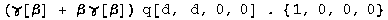

    
    

The separation is
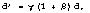presuming frame S'is moving in the same direction as the light.

(b) The elapsed time is the first component of the transformed quaternion from
above, or ![\[Graphics:ps3gr10.gif\]](images/SR/problem_set_3/ps3gr10.gif).

##  Baranger: The ladder in the barn

Q: (long) Manuel wants to demonstrate the Lorentz length contraction by
fitting his 10 m ladder inside his 8 m garage. He ties the ladder on top of
his station wagon and asks his friend Linda to drive the wagon into the open
door of the garage. Linda drives it at the speed of 0.8c, than therefore gamma
= 5/3, which makes the ladder only 6 m long. Manuel is standing by the door
and, as soon as the rear end of the ladder has passed, he shuts the door. He
now has the entire ladder inside the 8 m garage, just as he said he would.
However, this garage also has a back door and, since the brakes on the wagon
are a little worn out, Manuel has instructed his other friend Gwen to open the
back door at the precise instant that the front end of the ladder is about to
hit it. It's OK, says Manuel, because the ladder was actually inside the
garage, with both doors shut, for a finite amount of time, and that is all he
wanted to prove. But it turns out that Gwen's cat, CloudNine, was sitting all
the time on the ladder on top of the wagon, and CloudNine disagrees totally.
He says: the ladder was really 10 m, while the garage was Lorentz contracted
and only 8 m x 3/5 = 4.8 m, and obviously that the ladder was never, never
totally inside the garage. CloudNine looks in good health; the ladder is still
in one piece. What's going on? Who is right?  
INSTRUCTIONS: Define 4 separate events. Choose coordinates in two frames.
Elaborate the 2 descriptions of what happened, Manuel's and CloudNine's,
giving precise numbers for all the events. Show that these two descriptions
are actually totally consistent, given the known laws of special relativity.

A. From the viewpoint of the barn, the ladder is contracted. This involves
boosting the end of the ladder, and subtracting where the start of the ladder
has moved to at a simultaneous time.

    
    

Manuel observes (correctly) that the ladder appears to be length contracted to
6 m in his reference frame.

Repeat this exercise for the cat frame looking at the length of the barn.

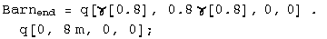

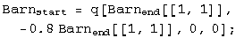

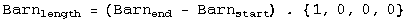

    
    
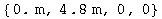
The barn is only 4.8m long from the cat's reference frame.

Manuel and the cat make correct statements about length contraction from their
own reference frames.

What makes this problem confusing to discuss is that the doors of the barn and
the ends of the ladder are spacelike separated, so the order of events in time
can be reversed depending on the reference frame.

The reference event chosen for the following spacetime diagrams (created in
the program Spacetime by Prof. Edwin F. Taylor) is Manuel meeting the start of
the ladder. The end of the barn and the end of the ladder must be located on
invariant hyperbolae 8 and 10 meters long respectively. Gwen must open the
door somewhere on the barn's 8 meter hyperbola. Manuel's dream will only come
true if the reference event and the two ends are not separated by Gwen's
action. This is not the case as seen in the figure below:

Gwen always opens the far barn door before both ends of the ladder and barn
are together with Manuel and the start of the ladder, averting disaster. The
barn stays in one piece and we have had fun with moving objects with spacelike
separations.

##  R&amp;H: 2-34 2 flashes at different places - or are they?

Q: An observer S sees a flash of red light 1200 m from his position and a
flash of blue light 720 m closer to him and on the same straight line. He
measures the time interval between the occurrences of the flashes to be 5
microseconds, the red flash occurring first. (a) What is the relative velocity
**v** of a second observer S' who would record these flashes as occurring at
the same place? (b) From the point of view of S', which flash occurs first?
(c) What time between them would S' measure?

A: (a) Boost both red and blue lights by beta into frame S'.

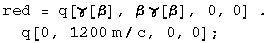

Set the distances equal to each other (the second components of the boosted
quaternions) and solve.

    
    

The second observer moves toward the first observer at a relative speed of
0.48c.

(b) Substitute the value for v/c into the boosted time for the events.

    
    
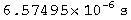
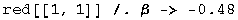

    
    

The red light happens first for observer S'.

(c) Calculate the difference between the first two components of the
quaternions.

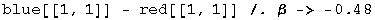

    
    
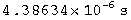
The time difference is 4.39 microseconds.

### Addition of velocities

If a quaternion is normalized to its interval, it becomes:

If a quaternion is normalized to its interval and the first term which is
gamma, the result is a quaternion characterizing the velocities:

This quaternion can be formed from any quaternion and boosted accordingly.

For this series of problems, we need a more general boost quaternion, one
where y and z are not zero.

Define the function Lambda to do the general boost along x.

## R&amp;H: 2-59 Watching the decay of a moving nucleus

Q: A radioactive nucleus moves with a uniform velocity of 0.050c along the x
axis of a reference frame S fixed with respect to the laboratory. It decays by
emitting an electron whose speed, measured in a reference frame S' moving with
the nucleus, is 0.80c. Consider first the case in which the emitted electron
travels (a) along the common x-x' axis and (b) along the y' axis and find, for
each case, its velocity as measured in frame S. (c) Suppose, however, that the
emitted electron, viewed now from frame S, travels along the y axis of that
frame with a speed of 0.80c. What is its velocity as measured in frame S'?

A: (a) Boost the velocity quaternion by -0.05c, and keep it as a velocity
quaternion by normalizing it with the resulting gamma.

    
    

The relative velocity in frame S is 0.817c along the x axis.

(b) Do that again, with y = 0.8.

    
    

The magnitude and angle of the velocity vector can be calculated.

    
    

    
    

The velocity vector is 0.8005c 3.58 degrees to the right of the y axis.

(c) Repeat the calculation, switching the sign of the boost.

    
    
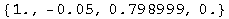
A similar quaternion to b, so the velocity vector is 0.80056c, but 3.57
degrees to the left of the y axis.

##  Baranger: Boosting boosted frames

Q: (a) Frame S' moves with respect to frame S with velocity beta1 in the +x
direction. Frame S'' moves with respect to frame S' with velocity beta2 also
in the + x direction. Frame S" moves with respect to frame S with velocity
Beta, also in the +x direction. Let gamma1, gamma2, and Gamma be the 3 Lorentz
factors corresponding to these 3 velocities, respectively. Prove the formula

(b) 2 identical particles are having a head-on collision. In their center-of-
mass frame, each has a Lorentz factor gamma. Assume gamma &gt;&gt; 1\. Now
look at them in the Lab frame in which one of them is at rest, and call Gamma
the Lorentz factor of the projectile particle. Show that Gamma is
approximately equal to
.
A: (a) From the reference frame of S', beta1 is towards it (so is negative)
and beta2 is away from S' (so it is positive).

    
    
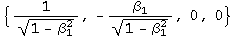

    
    

The first term is the gamma being sought. Note that the second term divided by
the first term gives the expected addition of relative velocities for frame
S'. The sign is opposite for frame S.

(b) If gamma &gt;&gt; 1, use the approximation for beta of one minus epsilon,
where epsilon is a small number. Plug into the results from part (a).

    
    

Square gamma.

    
    
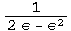
Substitute back into Gamma big.

    
    

Gamma for the projectile particle is the first term of the above quaternion,
approximately ![\[Graphics:ps3gr56.gif\]](images/SR/problem_set_3/ps3gr56.gif).

##  French: 5-7 2 ways to double a boost

Q: An inertial system S1 has a constant velocity v1 along the x axis relative
to an inertial system S. Inertial system S2 has a velocity v2 relative to S1.
Two successive Lorentz transformations enable up to go from (t, x, y, z) to
(t1, x1, y1, z1) and then from (t1, x1, y1, z1) to (t2, x2, y2, z2). Show that
this gives the same result as a single Lorentz transformation from (t, x, y,
z) to (t2, x2, y2, z2) provided we take the velocity of S1 relative to S as  
 .
A: Boost once, then again.

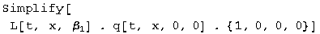

    
    

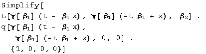

    
    

Now boost once using the addition of velocities rule.

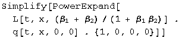

    
    
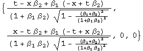
These two quaternions are identical, as expected.

##  Initialization functions

There are a few tools required to solve problems in special relativity using
quaternions to characterize events in spacetime. The most basic are a round
value for c and gamma.

Define a function for quaternions using its matrix representation.

A quaternion L that transforms a quaternion (L q[**x**] = q[**x'**]) identical
to how the Lorentz transformation acts on 4-vectors  
(Lambda **x** = **x'**) should exist. These are described in detail in the
notebook "A different algebra for boosts." For boosts along the x axis with y
= z = 0, the general function for L is

Most of the problems here involve much simpler cases for L, where t or x is
zero, or t is equal to x.

If t = 0, then

    
    

If x = 0, then

    
    

If t = x, then

    
    

Note: this is for redshifts. Blueshifts have a plus instead of the minus.

The problems are from "Basic Concepts in Relativity" by Resnick and Halliday,
1992 by Macmillian Publishing, "Special Relativity" by A. P. French, 1966,
1968 by MIT, and Prof. M. Baranger of MIT.

# 8.033 Problem Set 4: The Doppler Effect, 4-Vector Invariants &amp; the Twin
Paradox

##  **The Doppler Effect**

##  French: 5-9

Q: Three identical radio transmitters A, B, and C each transmitting at the
frequency ![\[Graphics:ps4gr1.gif\]](images/SR/problem_set_4/ps4gr1.gif) in its
own rest frame are moving as shown.  
&lt;\---A B C-- -&gt;  
(a) What is the frequency of B's signals as received by C?  
(b) What is the frequency of A's signals as received by C? There are at least
three ways to solve this question. See if you can find two.

A: (a) Let the inverse of the frequency be the time
. Redshift it!

    
    

The frequency is the inverse of the time component, or  

(b) We need another redshift of exactly the same size.

    
    

The frequency it the inverse of the time component, so
.
(b') Another approach is to boost the initial event with a speed equal to the
two boosts, which by the addition of velocity formula is shown below.

Redshift with this velocity and try to simplify.

    
    

A step away from the previous result.

##  French: 5-10

Q: A pulsed radar source is at rest at the point x = 0. A large meteorite
moves with constant velocity v toward the source; it is at the point x = -d at
t = 0. A first radar pulse is emitted by the source at t = 0, and a second
pulse at t = to (to &lt;&lt; d/c). The pulses are reflected by the meteorite
and return to the source. (a) Draw in spacetime graph (1) the source, (2) the
meteorite, (3) the two outgoing pulses, (4) the reflected pulses. (b) Evaluate
the time interval between the arrivals at x = 0 of the two reflected pulses.
(c) Evaluate the time interval between the arrivals as the meteorite of the
two outgoing pulses, as measured in the rest frame of the meteorite.  
Answer (b) and (c) first with a well-chosen Lorentz transformation. Then
answer again, this time using the Doppler effect and the results of the above
problem (French 5-9).

A: (a) This spacetime graph of the meteorite was constructed in the program
"Spacetime" by Prof. Edwin F. Taylor.

(b) Chose the frame of the Earth. The world line of the first pulse is  
q[t, -t, 0,0]. The worldline of the meteorite is q[t, v t/c - d,0,0]. Solve
for the time when the distances are the same.

    
    

The distance traveled is the same, so it arrives back at the Earth at

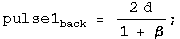

Find the time at which the second pulse arrives at the meteorite. The only
change is the departure of the pulse.

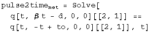

    
    

Use the time to find pulse 2's position.

    
    

Add these together to find the return time.

    
    

Examine the interval between the arrival of the two pulses back to the Earth.

    
    

The interval between the arrival of the two pulses is shifted by a factor
.
(c) Choose the rest frame of the meteorite. Boost the emission event to this
frame.

Add the time after being boosted together with the position needed to travel
to the meteorite to get the time of pulse 1 at the meteorite.

    
    

Repeat this process for pulse 2.

    
    

Examine the interval between the arrival of the two pulses at the meteorite.

    
    

The interval between the arrival of the two pulses at the meteorite is shifted
by a factor ![\[Graphics:ps4gr33.gif\]](images/SR/problem_set_4/ps4gr33.gif).

(b') From the reference frame of the meteorite, the pulse of light would be
blueshifted from the source, and blueshifted to the receiver. Use the result
from 5-9 (b).

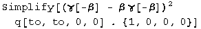

    
    

The time interval between pulses is
.
(c') As stated above, the pulse of light from the source is blueshifted, so
using a modified answer from 5-9 (a).

    
    

The time interval between pulse at the meteorite is
.
##  French: 5-11

Q: An astronaut moves radially away from the Earth at a constant acceleration
(as measured in the Earth's reference frame) of 9.8 m/s^2. How long will it be
before the redshift makes the red glare of the neon signs of Earth invisible
to his human eyesight?

A: Solve for the velocity which redshifts the wavelength of neon  
(~600 nm) to invisible (~700 nm).

    
    

The time required at a constant acceleration is t = v/a.

    
    

After 54 days, the neon lights become invisible to the astronaut's eyes.

##  French: 5-12

Q: There is a spaceship shuttle service from the Earth to Mars. Each spaceship
is equipped with two identical lights, one at the front and one at the rear.
The spaceships normally travel at a speed vo, relative to the Earth, such that
the headlight of a spaceship approaching Earth appears green (500 nm) and the
taillight of a departing spaceship appears red (600 nm). (a) what is the value
of vo/c? (b) One spaceship accelerates to overtake the spaceship ahead of it.
At what speed must the overtaking spaceship travel relative to the Earth so
that the taillight of the Mars-bound spaceship ahead of it looks like a
headlight (500 nm green)?

A: (a) Solve for the velocity that reverses the shifts to the same wavelength
(i.e., redshift the headlight's blueshifted light to the wavelength of the
taillight's blueshifted redshifted light ; )

    
    
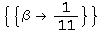
The spaceships travel at vo/c = 1/11.

(b) Solve for the velocity needed to shift the wavelength from 600 to 500 nm.

    
    

The required velocity is v/c = 11/61.

##  R &amp; H: 2-68 A Doppler shift revealed as a color change

Q: A spaceship is receding from the Earth at a speed of 0.20c. A light on the
rear of the ship appears blue (450 nm) to the passengers on the ship. What
color would it appear to an observer on the Earth?

A: Redshift the light at 450 nm by 0.20c.

    
    

The light appears at 551 nm, yellow.

##  R &amp; H: 2-71 The Ives-Stillwell experiment

Q: (long) Neutral hydrogen atoms are moving along the axis of an evacuated
tube with a speed of 2.0 x 10^6 m/s. A spectrometer is arranged to receive
light emitted by these atoms in the direction of their forward motion. This
light, if emitted from resting hydrogen atoms, would have a measured (proper)
wavelength of 486.13 nm. (a) Calculate the expected wavelength for light
emitted from the forward-moving (approaching) atoms, using the exact
relativistic formula. (b) By using a mirror this same spectrometer can also
measure the wavelength of light emitted by these moving atoms in the direction
opposite to their motion. What wavelength is expected under this arrangement?
(c) Calculate the difference between the average of the two wavelengths found
in (a) and (b) and the unshifted (proper) wavelength. Find the second order
dependence on beta. By this technique, Ives and Stillwell were able to
distinguish between the predictions of the classical and the relativistic
Doppler formulas.

A: (a) &amp; (b) Red- and blue shift the light at 486 nm +/- the speed of the
moving hydrogen.

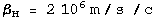

    
    

    
    

    
    
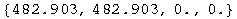
The light is redshifted to 489.4 nm and blueshifted to 482.9 nm.

(c) We can measure the average of these two shifted wavelengths, or their
average difference.

    
    

    
    

According to classical theory, if the observer is fixed, and the source moves,
there is no second order dependence on beta.

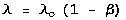

If the source is fixed but the observer moves, then

Special relativity predicts a coefficient of +0.5 for the beta squared term,
the one measured in the lab.

##  R&amp;H: 2-83 The headlight effect

Q: A source of light, at rest in the S' frame, emits uniformly in all
directions. The source is viewed from frame S, the relative speed parameter
relating the two frames being beta. (a) Show that at high speeds, the forward-
pointing cone into which the source emits half of its radiation has a half
angle given closely, in radian measure, by

(b) What value of the half angle is predicted for the gamma radiation emitted
by a beam of energetic neutral pions, for which v/c = 0.993? (c) At what speed
would a light source have to move toward an observer to have half of its
radiation concentrated into a narrow forward cone of half angle 5.0 degrees?

A: This problem requires a boost quaternion that works with nonzero values for
t, x, y, and z. See the last problem set in the addition of velocities section
for the derivation of the following boost quaternion, or the notebook on
"Alternative algebra for boosts":

Boost a spherically symmetric velocity quaternion, normalizing to the
resulting gamma so the resulting quaternion still characterizes velocities.

    
    

Calculate the angle directly from the ratio of speeds.

    
    
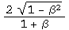
As beta approaches 1, this angle approaches
.
(b) Let beta -&gt; 0.993.

    
    

The predicted half angle for the gamma rays is 6.79 degrees.

(c) Solve for beta, given the angle.

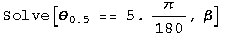

    
    

A light source would have to travel at 0.9962c to concentrate its radiation in
a forward cone of half angle 5 degrees.

##  **Four-Vector Invariants**

##  Baranger: Decay of a particle - timelike or spacelike?

Q: In event 1, an unstable particle is produced in the target of an
accelerator. In event 2, this particle decays 5 meters away. Is the interval
between these two events timelike or spacelike? Why?

A: The speed of the particle must be less than one, or x/t &lt; 1\. If event 1
is at the origin and event 2 has a spatial position of 5m, it must have a time
of 5m + a (a&gt;0). Calculate the square of the interval by squaring the
quaternion.

    
    

The square of the interval a^2 + 10a is always positive, so the interval is
timelike in the future.

##  R&amp;H: 2-42 The interval is invariant - check it out

Q: Two events occur on the x axis of reference frame S, their spacetime
coordinates being event1 = q[5 us, 720 m,0,0 ] and event 2 = [2 us, 1200 m,0,0
]. (a) What is the square of the spacetime interval for these two events? (b)
What are the coordinates of these events in a frame S' that moves at speed
0.60c in the direction of increasing x? Calculate the square of the interval
in this frame and compare it to the value calculated for frame S. (c) What are
the coordinates of these events in a frame S" that moves at a speed of 0.95c
in the direction of decreasing x? Again calculate the square of the spacetime
interval and compare it with the values found in (a) and (b). Do your
calculations bear out the invariance of the spacetime interval?

A: (a) The square of the spacetime interval between events 1 and 2 is the
first term of difference between the quaternions squared.

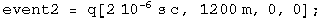

    
    

The square of the interval between event 1 and 2 is 5.8 x 10^5 m^2.

(b) Boost the quaternions and then square them.

    
    

The square of the interval between the boosted events is the same.

(c) Repeat the exercise with a new value for beta.

    
    

Again, the square of the interval between the boosted events is the same. The
first term of the square of a quaternion is identical to the first term of a
square of a boosted quaternion.

##  R&amp;H: 2-43 An event pair - timelike or spacelike?

Q: Two events occur on the x axis of reference frame S, their spacetime
coordinates being event1 = q[5 us, 200 m,0,0] and event 2 = [2 us, 1200
m,0,0]. (a) What is the square of the spacetime interval for these two events?
(b) What is the proper distance interval between them? (c) If two events
possess a (mathematically real) proper distance interval, it should be
possible to find a frame S' in which these events would be seen to occur
simultaneously. Find this frame. (d) Can you calculate a (mathematically real)
proper time interval for this pair of events? (e) Would you describe this pair
of events as timelike? Spacelike? Lightlike?

A: (a) The square of the spacetime interval between events 1 and 2 is the
first term of difference between the quaternions squared.

    
    

The square of the interval between event 1 and 2 is -1.9 x 10^5 m^2

(b) The proper distance interval is the square root of the negative of this
number.

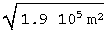

    
    

The proper distance is 436 m.

(c) Boost both event quaternions by beta, set the time components equal to
each other, and solve for beta.

    
    
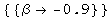
In frame S', the events will appear simultaneous for v/c = 0.9 in the
direction of decreasing x.

(d) &amp; (e) For events that are spacelike separated, there is no meaningful
measure of proper time.

##  R&amp;H: 2-44 An event pair - spacelike or timelike?

Q: Two events occur on the x axis of reference frame S, their spacetime
coordinates being event1 = q[5 us, 720 m,0,0] and event 2 = [2 us, 1200
m,0,0]. (a) Using the data from problem 2-42 above, calculate the proper time
interval for this pair of events. The proper time interval that you have
calculated should be smaller than any of the actual time intervals in the
three given frames of problem 2-42. Is it? (b) If two events possess a
(mathematically real) proper time interval, it should be possible to find a
frame S' in which these events would be seen to occur at the same place. Find
this frame. (c) Can you calculate a (mathematically real) proper distance
interval for this pair of events? (d) Would you describe this pair of events
as timelike? Spacelike? Lightlike?

A: (a) To make this question more of a challenge, let's define a quaternion
"Ltau" which maps an arbitrary timelike quaternion to its proper time:  
  
Ltau . q[t,x,y,z] = q[tau, 0, 0, 0] .  
  
To find Ltau, multiply the above equation on the right by the inverse of
q[t,x,y,z].

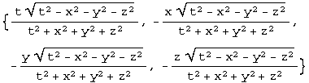

    
    

Works to within default accuracy.

Now on to the question. Map the given quaternion to its proper time interval.

    
    

The proper time is 2.54 microseconds. This is less than the time of 3
microseconds observed in this frame.

Boost the interval up 0.6c, &amp; repeat the cycle.

    
    

    
    

The interval 2.53 microseconds is the same, less that 4.95 microseconds
observed.

    
    

    
    

The interval is the same, less that 4.74 microseconds observed.

(b) Boost both event quaternions by beta, set the space components equal to
each other, and solve for beta.

    
    

The frame must move a speed 0.53c in the direction of decreasing x.

(c) &amp; (d) The interval is timelike. It is not meaningful to search for a
proper distance between these two events.

##  **The Twin Paradox**

##  The tortoise &amp; the hare

Q: The tortoise challenges the hare to a race in the woods. The hare laughs
hysterically saying "Surely, M'am, you are not serious?" But the tortoise is
serious; she gets on the course and starts running(?) right away. The course
is a closed loop beginning and ending at the same tree. While the tortoise is
running, the hare continues telling jokes with his friends. But when he sees
that she has almost gotten back to the finish, he decides that it is time to
teach her a lesson, and he dashes on the course as quick as he can to catch up
with her. Alas, he miscalculated slightly and he returns to the tree just
barely behind her!  
QUESTION: Assuming that the two animals were of the same age before the race,
which one is older at the end of it? Justify your answer with quantitative
arguments!

A: Let the hare run the fraction f of the tortoise's proper time t. Calculate
the tortoise's squared interval in terms of this fraction.

    
    

In the tortoise's reference frame, the hare initially travels away from the
tortoise at the slow Btort speed for time t. Then the hare starts traveling
toward the tortoise at Bhare speed for a time (1-f) t. Calculate the hare's
squared interval.

    
    

Look at the difference.

    
    

Since this term is always negative, the hare is necessarily younger than the
tortoise.

##  R&amp;H: B2-2 Einstein and the clock "paradox"

Q: Einstein, in his first paper on the special theory of relativity, wrote the
following: "If one of the two synchronous clocks at A is moved in a closed
curve with constant velocity until it returns to A, the journey lasting t
seconds, then by the clock that has remained at rest the travelled clock on
its arrival at A will be t v^2/2 c^2 seconds slow." Prove this statement.
(Note: Elsewhere in his paper Einstein indicated that this result is an
approximation, valid only for v &lt;&lt; c.)

A: Compare the intervals of the two clocks, one that has move, the other that
has remained.

    
    

If beta &lt;&lt; 1, calculate the series expansion.

    
    

The moving clock is t v^2/2 c^2 slower than the one at rest.

##  R&amp;H B2-12: Getting Younger

Q: Can you think of any way to use space travel to reverse the aging process,
that is, to get younger? Could you send your parents out on a long space
voyage and have them be younger than you are when they get back?

A: There are actually two questions here. Starting with the last question
first, with a HUGE investment of energy for the parents, time will appear to
run at a slower rate than the clocks back at home. The energy investment is
the critical parameter to determine if the clocks will run at different enough
rates to have the parents return younger than their children.

The second question concerns reversing the aging process. The aging process
will appear to procede in the same manor for both parent and child. Why is
this not reversable? Find the quaternion that reverses time.  
  
LTimeRev q[t, x, y, z] = q[-t, x, y, z]  
  
Compute LTimeRev by multiplying on the right by the inverse of q[t,x,y,z].

Aboard the spaceship, or on the Earth, t &gt;&gt;&gt; x, y and z, so the time
reversal quaternion is approximately

Test that this works for someone moving a meter per second in the x direction,
0.5 m/s in the y.

    
    

The proposed quaternion does reverse time in the classical regime. Note that
it is predominantly a scalar, almost q[-1,0,0,0] However, it is not _exactly_
the identity. If we think about time reversal for two nearby worldlines, they
will not commute by the small factor found in the second through fourth terms.
This observation may lead to a new justification of the second law of
thermodynamics.

##  French: 5-20 Signals from twins

Q: A and B are twins. A goes on a trip to Alpha Centauri (4 light- years away)
and back again. He travels at speed 0.6c with respect to the Earth both ways,
and transmits a radio signal every 0.01 year in his frame. His twin B
similarly sends a signal every 0.01 years in his own rest frame. (a) how many
signals emitted by A before he turns around does B receive? (b) How many
signals does A receive before he turns around? (c) What is the total number of
signals each twin receives from the other? (d) Who is younger at the end of
the trip, and by how much? Show that the twins both agree on this result.

A: Start out by drawing the signals sent and received from B's frame of
reference.

(a) The signals from A out are redshifted and received at B for a time of ...

    
    

The signals are sent at a rate of 100/year as viewed by the sender. This rate
is lowered by the redshifting, so the total number of signals is the lower
rate times the amount of time the signals are received.

    
    

B receives 533 redshifted signals from A.

(b) The signals from B are not shifted in B's frame, but are received at A for
a time of...

    
    

    
    

A receives 266 signals from B during A's trip to Alpha Centauri.

(c) It is easiest to calculate the number of signals received by A since the
rate with B as a reference frame is constant.

    
    

A receives a total of 1333 signals from B.

B gets blueshifted signals for a short time. The rate of signals goes way up.

    
    

    
    

    
    

B receives a total of 1066 signals from A.

(d) B has sent out 1333 signals, but has only received 1066 from A, so he has
experienced more ticks of the clock. The difference is due to the
instantaneous change of reference frame experienced by A.

##  Initialization functions

There are a few tools required to solve problems in special relativity using
quaternions to characterize events in spacetime. The most basic are a round
value for c and gamma.

Define a function for quaternions using its matrix representation.

A quaternion L that transforms a quaternion (L q[**x**] = q[**x'**]) identical
to how the Lorentz transformation acts on 4- vectors  
(Lambda **x** = **x'**) should exist. These are described in detail in the
notebook "A different algebra for boosts." For boosts along the x axis with y
= z = 0, the general function for L is

Most of the problems here involve much simpler cases for L, where t or x is
zero, or t is equal to x.

If t = 0, then

    
    

If x = 0, then

    
    

If t = x, then

    
    

Note: this is for blueshifts. Redshifts have a plus instead of the minus.

The problems are from "Basic Concepts in Relativity" by Resnick and Halliday,
1992 by Macmillian Publishing, "Special Relativity" by A. P. French, 1966,
1968 by MIT, and Prof. M. Baranger of MIT.

# 8.033 Problem Set 5: Energy, Momentum and Mass

##  French: 6-3

Q: A particle of rest mass m and kinetic energy 2 m c^2 strikes and sticks to
a stationary particle of rest mass 2m. Find the rest mass M of the composite
particle.

A: Calculate the square of the mass of the system by squaring the quaternion
and looking at the first term.

    
    

The mass of the composite particle is
.
##  French: 6-4

Q: (a) A photon of energy E collides with a stationary particle of rest mass m
and is absorbed. What is the velocity of the resulting composite particle? (b)
A particle of rest mass mo moving at a speed of 4/5c collides with a similar
particle at rest and forms a composite particle. What is the rest mass of the
composite particle and what is its speed?

A: (a) The speed can be calculated from the ratio of the momentum to the
energy. Define the before and after quaternions, set these ratios equal to
each other and solve.

    
    

The velocity of the composite particle is
.
(b) The problem is the same, only the numbers have been changed to protect the
writer.

    
    

Because mass is conserved, the mass of the composite equals the mass of the
system before the collision.

    
    

The composite travels at 0.5c with a mass of
.
##  Baranger: The projectile

Q: A projectile of rest mass M1, energy E1, and momentum p1, is directed at a
stationary target of mass m2. Find a simple expression for the velocity of the
center of mass frame.

A: Define the before and after quaternions (a boost to the center of mass
frame - not a collision!).

We need to find a boost that will transform between the two. The boost
quaternion is simple for the center of mass frame where x=y=z=0.

The ratio of the second component to the first one is p/E or v/c, exactly what
we are looking for.

    
    

The velocity of the center of mass frame is
.
##  French: 6-11

Q: The neutral pi meson decays into two gamma rays (and nothing else). If the
pion (whose rest mass is 135 MeV) is moving with a kinetic energy of 1 GeV:
(a) What are the energies of the gamma rays if the decay process causes them
to be emitted in opposite directions along the pion's original line of motion?
(b) What angle is formed between the two gamma rays if they are emitted at
equal angles to the direction of the pion's motion?

A: (a) Define the before and after quaternions.

Solve for E2 using energy conservation, then E1 using momentum conservation.

    
    

One gamma is 1131 MeV, the other is 4 MeV.

(b) The after quaternion has been changed. Solve first for the energy, then
the angle.

    
    

Theta is the half angle in radians.

    
    

There is 13.6 degrees between the two gamma rays.

##  French: 6-14

Q: Show that the following processes are dynamically impossible: (a) A single
photon strikes a stationary electron and gives up all its energy to the
electron. (b) A single photon in empty space is transformed into an electron
and a positron. (c) A fast positron and a stationary electron annihilate,
producing only one photon.

A: (a) By inspection, momentum is conserved only if E = 0.

    
    

A photon with no momentum is no photon at all.

(b) The square of the mass of the photon is zero. Examine the same for the
electron and positron.

    
    

The mass in never less than 2 m, so this transition violates conservation of
mass.

(c) The mass of the photon is zero. Find out the mass of the electron and
positron..

    
    

There is no choice of theta that makes the mass zero, so the transformation is
not possible without a violation of conservation of mass.

##  French: 7-1

Q: A K meson traveling through the laboratory breaks up into two pi mesons.
One of the pi mesons is left at rest. What was the energy of the K? What is
the energy of the remaining pi meson? (Rest mass of K meson = 494 MeV; rest
mass of pi meson ~137 MeV).

A: Define the quaternions for the before and after states.

    
    

The kinetic energy will be E - M = gamma M - M.

    
    

The pion has 616.6 MeV of kinetic energy.

Use the fact that energy is conserved to calculate the kinetic energy of the K
meson.

    
    

The K meson has 396.6 MeV of kinetic energy.

##  Baranger: Protons to K's

Q: Consider the annihilation of an antiproton with a proton, both particles
being at rest, according to the reaction

mass p = 940 MeV/c^2, mass kaon = 500 MeV/c^2. (a) Find the kinetic energies
and momenta of the created kaon particles. (b) If the proper lifetime of the
kaon's is 10^-10 s, find their actual lifetime in the lab frame and the
distance they travel.

A: (a) The mass of the system is 1880 MeV. After the creation of the kaon's,
the total momentum is still zero.

    
    

    
    

    
    

Each kaon has 440 MeV of kinetic energy and a momentum of 796 Mev.

(b) t' = gamma t and d' = beta c t'. Simple stuff.

    
    

    
    

In 0.188 nanoseconds, the kaon's travel 4.77 cm.

##  Baranger: A photon collision

Q: A photon of energy E = 600 MeV, traveling in the +x direction, hits a
stationary particle of rest energy M c^2 = 1000 MeV. After the collision,
these two particles are replaced by two new particles of masses m1 and m2
respectively. The total energy (including rest energy) of particle 1 is E1 =
700 MeV and its momentum is p1x = 400 MeV, p1y = 300 MeV. (a) Draw a "before
and after" picture. (b) Find the energy and the momentum of particle 2. (c)
Find the masses m1 and m2.

A: (b) Lots of data is given to define the quaternions.

Because energy and mass are conserved, we know by inspection that for particle
2, E2 = 900 MeV, p2x c = 200 MeV, p2y c = -300 MeV.

    
    

(c) Calculate the masses by squaring the quaternions.

    
    

    
    

The masses are m1 = 490 MeV and m2 = 825 Mev.

##  Baranger: Multiplying 4 vectors

Q: Let the energy-momentum 4-vector be

Let the 4-velocity be the 4-vector

Prove (carefully, rigorously!) that, if a particle of 4 momentum p is observed
by an observer of 4-velocity u, then the energy of the particle in the frame
of the observer is

HINT: Choose special, convenient coordinate axes for the space components (and
say what these axes are).

A: Choose to define the velocity vector in terms of the momentum vectors.
Define the two quaternions.

Calculate their product, looking at the first term which has units of energy.

The result can be written as
.
There is an even easier way to express this product.

    
    

This is M/E or 1/gamma. This result was due to the unusual choice of the
velocity vector. Look at the other terms.

    
    

The entire quaternion product is

##  Baranger: An inelastic collision

Q: Consider the following inelastic collision:

Find the mass of the incoming projectile.

A: Determine the gammas from the kinetic energy and masses given.

    
    

    
    

We can calculate the py momentum for the m140 particle.

    
    

The py momentum for the m1100 must be equal and opposite, which allows a
calculation of the angle.

    
    

Calculate the amount of momentum in the x direction.

    
    

    
    

    
    

All of this momentum is from the incoming projectile.

Calculate the total energy after minus m940 to get the energy of the incoming
projectile.

    
    

Calculate the mass of incoming projectile the usual way by looking at the
first term of the square root of the squared quaternion.

    
    

The mass of the incoming projectile is 588 MeV.

##  Initialization functions

There are a few tools required to solve problems in special relativity using
quaternions to characterize events in spacetime. The most basic are a round
value for c and gamma.

Define a function for quaternions using its matrix representation.

A quaternion L that transforms a quaternion (L q[**x**] = q[**x'**]) identical
to how the Lorentz transformation acts on 4- vectors  
(Lambda **x** = **x'**) should exist. These are described in detail in the
notebook "A different algebra for boosts." For boosts along the x axis with y
= z = 0, the general function for L is

Most of the problems here involve much simpler cases for L, where t or x is
zero, or t is equal to x.

If t = 0, then

    
    

If x = 0, then

    
    

If t = x, then

    
    

Note: this is for blueshifts. Redshifts have a plus instead of the minus.

The problems are from "Basic Concepts in Relativity" by Resnick and Halliday,
1992 by Macmillian Publishing, "Special Relativity" by A. P. French, 1966,
1968 by MIT, and Prof. M. Baranger of MIT.

#  8.033 Problem Set 6:  The Compton Effect and Threshold Collision Problems

##  French:  6-16 The Compton effect

Q:  The usual theory of the Compton effect considers a stationary free
electron being struck by a photon, resulting in a scattered photon of lower
energy.  Suppose that a photon (of energy E) has a head-on collision with a
_moving_ electron (of rest mass mo)  What initial velocity does the electron
have if the collision results in a photon recoiling straight backward with the
same energy E as the incident photon?

A:  There are the same number of particles before and after, traveling in
opposite directions with the same energy.  Define the before and after
quaternions.

Conserve momentum and solve for the speed.

The initial velocity of the electron is
`****`.

##  French:  6-17

Q:  A stream of very high energy photons (&gt;&gt;10 MeV) is fired at a block
of matter.   Show that the energy E of the photons scattered directly backward
is essentially independent of the energy of the incident photons.  What is the
value of E backward?

A:  Define the relevant quaternions.

Solve for the energy forward using energy conservation.

Solve for the energy back using momentum conservation and the previous result.

As beta approaches one, the value of E backward approaches 1/2 mc^2.  The
photons are most likely to collide with electrons of mass 511 MeV, so E
backward is approximately 255 MeV.

##  French:  6-18

Q:  (a) A photon of energy hv collides elastically with an electron at rest.
After the collision the energy of the photon is hv/2, and it travels in a
direction making an angle of 60 degrees with its original direction.  What is
the value of the frequency?  What sort of photon is it?  (b) A photon of
energy hv  collides with an excited atom at rest.  After the collision the
photon still has energy hv, but its direction has changed by 180 degrees.nbsp;
If the atom is in its ground state after the collision, what was its initial
excitation energy?

A:  (a) Define the before and after quaternions.

By conservation of energy and momentum, the beforeq minus the afterq should be
zero.

There are 3 equations (each term is equal to zero) and three unknowns (hv,
alpha, and theta).  Eliminate theta using a trig identity, then eliminate
alpha using a hyperbolic trig identity.  (It's not easy, but it does work).

This identity equals 1, so it can be solved for hv.

Find the frequency by putting in the appropriate constants.

The frequency of the photon is 2.5 10^20 s^-1, a gamma ray.

(b) Define the before and after quaternions.

Solve for beta in terms of the ground state using momentum conservation.

Solve for the excited state using energy conservation.

The excitation energy will be .

##  French:  6-19

Q:  A high-energy photon strikes and is scattered by a proton that is
initially stationary and completely free to recoil.  The proton is observed to
recoil at a 30 degree angle with a kinetic energy of 100 MeV.  (a) What was
the energy of the incident photon?  (b) What are the direction and energy of
the scattered photon?

A:  (a) Define the before and after quaternions.

By conservation of energy and momentum, the beforeq minus the afterq should be
zero.

There are 2 equations (each term is equal to zero) and 2 unknowns (E and
theta).  Eliminate the angle using a trig identity.

This identity equals 1, so it can be solved for hv.

The incident photon is E + 100 MeV, or 329 MeV.

(b)  The energy of the scattered photon was calculated above at 229 MeV.  The
momentum in the conservation quaternion can be solved for theta.

The photon scatters at an angle of 104
degrees

##  French: 7-2

Q:  An electron-positron pair can be produced by a gamma ray striking a
stationary electron:

What is the minimum gamma ray energy that will make this process go?

A:  Define the before and after quaternions.

Set the square of the masses equal to each other and solve for E.

The minimum energy of the gamma ray is 2044 MeV.

##  Baranger:  Threshold KE

Q:  What is the threshold kinetic energy, in the Lab system, for the reaction:

The protons have mass M, the pions have mass m.  Set c = 1.

A:  K = E - M.  gamma = E/M = K/M + 1.  These relations can be used to define
the before and after quaternions.

Set the masses equal to each other and solve for K.

The minimum kinetic energy required is K = (2m^2 + 4m M)/M.

##  French:  7-3

Q:  Suppose that a certain accelerator can give protons a kinetic energy of
200 GeV.  The rest mass mo of a proton is 0.938 GeV.  Calculate the largest
possible rest mass Mo of a particle X that could be produced by the impact of
one of these high-energy protons on a stationary proton in the following
process:

A:  K = E - M.  gamma = E/M = K/M + 1.  These relations can be used to define
the before and after quaternions.

Set the square of the masses equal to each other and solve for X.

The largest possible rest mass is 17.6 GeV for this accelerator.

##  Baranger:  Another threshold

Consider the reaction:

The target proton is at rest.  The rest mass of the proton is 940 MeV and the
pion is 140 MeV.  (a) Calculate the threshold kinetic energy of the incident
pion for this reaction.  (b) At threshold, calculate the velocities and
momenta of the final-state proton and the pions in the lab system.

A:  (a) Define the before and after quaternions.

Set the square of the masses equal to each other and solve for K.

The threshold kinetic energy of the pion is 171 MeV.

(b) In the center-of-mass frame, all three particles are at rest.  In the Lab
frame, all three particles have the same velocity, but different momenta.
Calculate the energy before.

The gamma after is this energy divided by the mass.

Knowing gamma, both velocity and momenta can be calculated.

The particles have a relativistic velocity of 0.22, the pions have a momentum
pc = 31.7 MeV, and the protons have a momentum of pc= 213 MeV.

##  French: 7-6

Q:  The kinetic energy K of a system in the lab frame is related to the
kinetic energy K* in the center of mass frame in the nonrelativistic case by
the expression K = K* + MV^2/2, where M is the total mass of the system and V
is the velocity of the center of mass.  What is the analogous expression for
the relativistic case?  Show that it reduces to the above result if all speeds
are much less than c.

A:  Boost the quaternion for the center-of-mass frame to the lab, where Mo is
the sum of the rest masses of the particles in the system.

Energy is conserved, so `****`.

The kinetic energy in the lab frame is
.
Look at the nonrelativistic limit.

    

Note that  (K + Mo c^2) is the total mass of the system.  In the
nonrelativistic limit, the lab kinetic energy equals the kinetic energy within
the center of mass frame plus the kinetic energy of all the individual masses
in the center of mass frame.

##  Post ramble:  Initialization functions

There are a few tools required to solve problems in special relativity  using
quaternions to characterize events in spacetime.  The most basic are a round
value for c and gamma.

Define a function for quaternions using its matrix representation.

A quaternion L that transforms a quaternion (L q[**x**] = q[**x'**]) identical
to how the Lorentz transformation acts on 4-vectors  
(Lambda **x** = **x'**) should exist.  These are described in detail in the
notebook "A different algebra for boosts."  For boosts along the x axis with y
= z = 0, the general function for L is

Most of the problems here involve much simpler cases for L, where t or x is
zero, or t is equal to x.

If t = 0, then

If x = 0, then

If t = x, then

Note: this is for blueshifts.  Redshifts have a plus instead of the minus.

The problems are from "Basic Concepts in Relativity" by Resnick and Halliday,
1992 by Macmillian Publishing, "Special Relativity" by A. P. French, 1966,
1968 by MIT, and Prof. M. Baranger of MIT.

# Personal Sketch of Doug Sweetser

My father went to Harvard University and Harvard Law School as his father did. He read voraciously. My mother went to Boston University getting a degree in Physical Therapy. They had one poor date in a canoe. While in Europe, my father tracked down my mother, and with nearly all the details lost to me, wooed her accross the pond.

I was born in Bronxville, New York, in 1962. We had both a stay at home mom and live in maid. My father worked at the New York Times a corporate lawyer. When I was five, he got a job at the Minneapolis Star and Tribune. The family moved into a house with almost 10 acres of land. I went to a The Blake School an all boys private school, until it became the plural Blake Schools and coed in seventh grade (great timing). My education continued at M.I.T. where I got degrees in Biology and Chemical engineering. Note: I did not get a degree in either mathematics or physics.

I am a solid core nerd. A hard core nerd has strong opinions about all the versions of Star Trek. A solid core nerd does not watch the show because the science is so impossibly wrong. In Star Trek, space is treated like Manhattan: go to the next stop, and a wonderfully different collection of people are there. One can easy go from Wall Street Suits, to Chinatown, to Uptown, to Harlem, Spanish or otherwise. Space in the Universe is really just space, with distances too far for people to travel.

# Professional sketch of Doug Sweetser

## Education
MIT, 1980-1984 SB: Biology SB: Chemical Engineering GPA: 4.0 (I should point 
out MIT is on a 5.0, so 4.0 sounds great)

MCD Biology - University of Colorado Boulder, 1987-1989 Ph.D. Program Left on 
own accord.

Math Department - University of Indiana, Bloomington, 1990 Graduate level 
courses Left on own accord.

Brandeis, 2000-2002 MS: Computer Software Engineering

##Work Experience

### Biology

My first job was as a lab tech at the newly opened Whitehead Institute for 
Biomedical Research. On the first week on the job, Prof. Rick Young showed me 
how to clone the first genes ever from the Mycobacteria that causes leprosy.  
The work was featured on a NOVA documentary. Twelve technical papers were 
written in a three year paper in the most important journals in biology, 
including Nature, Cell, and the Proceedings of the National Academy of Sciences 
(PNAS).

Worked as a lab tech for Jac Nickoloff at the Harvard School of Public Health 
(8 years). My heart was elsewhere (which caused problems on the job).

### Computers

The first Internet Service Provider (ISP) was started in Brookline, MA in 
1989. They were my first ISP. After leaving the biology business, I worked the 
phones in a support role. I also helped maintain the billing software written 
in Perl. The shifting landscape of ISPs lead then to downsize in 2003.

I was the 9th employee of Black Duck Software. They initially wanted to help 
companies understand the licensing requirements behind open source software. I 
was hired as a "spider", crawling the Internet and harvesting open source 
software for our knowledgebase.

## Physics

### Initial interest

In the Christmas of 1988, both my mother and sister independently bought the 
book: "A Brief History of Time" by Stephen Hawking. I view that as my "born 
again" moment, one based on physics, not the Bible. For a month long period, my 
mind kept rearranging information, sure that everything somehow made sense. I 
was aware I was babbling - saying words that are part of the lexicon of 
physics, but would not make sense to an actual physicist. I decide to keep a 
day job, but work study physics in the background.

Boston was the perfect city in the 1990s to study physics on the side. I took a 
Harvard Extension class on Special Relativity taught by Edwin F. Taylor as he 
was writing the book "Spacetime Physics" with Johnathon Wheeler. Taylor would 
bring in a new chapter from Copy Copy, and we were assigned to critique it.  
Thus became my respectful skeptical analysis of physics. I decide to keep a day 
job, but work study physics in the background.

I was able to show some of my earliest efforts to a famous physicist who worked 
at MIT. He said it was "interesting, but not very interesting". The reason was 
I did not have a theory, a means to make many calculations. At the time, all I 
had were a few math widgets.

### First work on quaternions

In the struggle to find a theory, I held a small contest on a moderated 
newsgroup, sci.physics.research in 1997. I asked readers to provide a brief 
definition of time. It had to be about math or physics, not philosophy, and 
needed to be two sentences or less. In one math book, I recalled some odd sort 
of number that was like a scalar and a vector. The contest motivated me to 
reread that passage, then go to an old-fashion library and read up about 
quaternions. This was the first equation I saw, the squaring of a quaternion:

To this day, this makes me excited because the first term is at the core of 
special relativity as taught to me by Edwin F. Taylor. It is there, for free.  
That cannot be an accident. That observation drove me to purchase the domain 
quaternions.com.

### Major failure at a unified field theory

I struggled to come up with a way to deal with gravity using only quaternions.  
One lesson from general relativity is that a theory of gravity must be a metric 
theory - a theory where the calculation of distance depends on where one 
happens to be in a gravitational field. Measuring distance is a symmetric 
operation, meaning there is no handed to doing the work. Quaternions do have a 
handedness. There is no way around that. So I reinvented hypercomplex numbers.  
Those have all the same multiplication rules as quaternions, but no minus signs 
anywhere. As such, hypercomplex numbers could be used to characterize a metric.

I confess to having pride in the proposal, enough to print up t-shirts. It was 
difficult to find a professional to review the body of work. I began blogging 
on Science20.com. There I found a few technically skilled readers. When I 
finally got to presenting what I called the GEM proposal, several readers 
objected to the work. It took a little over a month for me to really see the 
proposal like they did. The flaw was deadly. A Lagrangian constructed from 
quaternions will not change under a rotation. It will therefore conserve 
angular momentum. A Lagrangian constructed from hypercomplex numbers will 
change under a rotation. It will not conserve angular momentum. Kepler's law of 
equal area in equal time is a statement that gravity conserves angular 
momentum. Thus a proposal for gravity using hypercomplex number in the 
Lagrangian is wrong. End of story.

### Current research

Web sites:

* [Quaternions.com](http://quaternions.com), the mothership of my private
  research project.

* [Numbers 101](http://bit.ly/vp-101), a visual introduction to space-time
  numbers, aka quaternions.

* [Measurement 101](http://bit.ly/vp-QG), a site dedicated to my new proposal 
for quaternion gravity

* [VisualPhysics.org](http://visualphysics.org) has a collection of analytic 
  animations generated with a user-hostile set of tools I wrote.

#### Quaternion space-times-time invariance as gravity

I went back to the equation that sparked my initial interest in quaternions:

The first term is called the interval. But what are the next three called? 
Physics doesn't have a name. That is a problem because the first term is one of 
the most important in physics because it is at the heart of special relativity.  
I came up with a reasonable name for the three amigos: space-times-time. I 
asked a simple question: what if space-times-time was invariant, then what sort 
of physics results? That could be gravity, but a very different theory because 
it is not a field theory. There would be no graviton, nor any quantum gravity 
theory. The idea had enough promise that I submitted an 1500 word paper to the 
2015 Gravitation Research Foundation Essay on Gravity.  We will see if they 
like it.

# Contact and tip info

Doug Sweetser
email: sweetser@alum.mit.edu
twitter: visualphysics

If it is really important to you, a google hangout can be arranged.

{! /Users/doug/Q/docs/About/web_sites.md !}

## Tip Jar

This is a part-time job for me that eats real money (~$60k over 2 decades).

https://cash.me/$VisualPhysics
